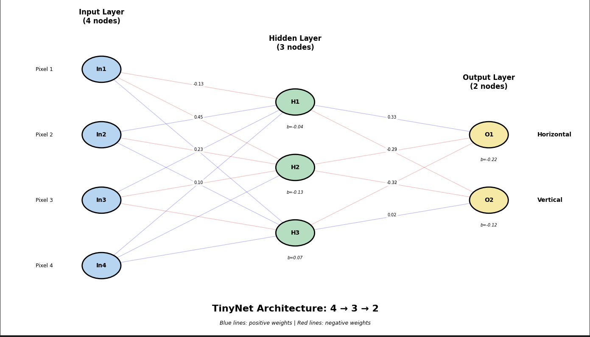
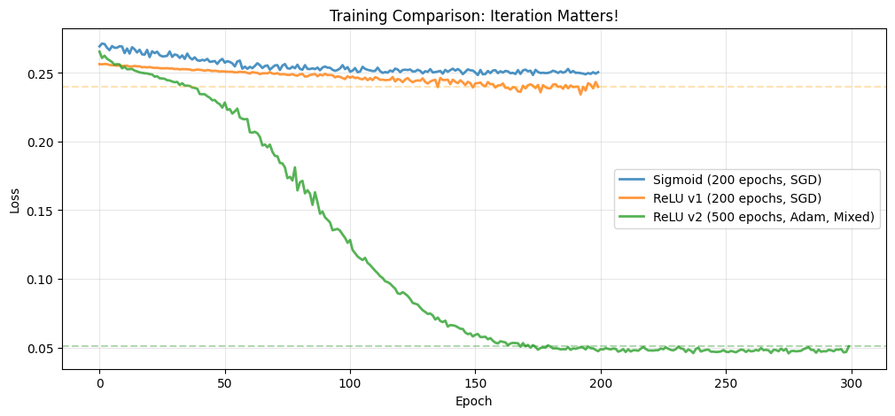

# Hello Neural World (TinyNet)

**A minimal neural network learning project designed to demystify the "Black Box" of ML.**

This repository follows my journey of scaling down complexity to understand the **Neural Nudge**—the fundamental mechanics of how a network learns when it is told it is wrong. By using a minimalist **4→3→2 architecture** (just 23 parameters), every gradient update and weight shift becomes trackable and deterministic.

## What's Inside

- **2 Interactive Runbooks**: Detailed Jupyter notebooks that move from the "Spatial Logic" of 2x2 grids to the core math of backpropagation.
- **The Engine**: A modular Python package containing reusable training loops, model definitions, and data utilities.
- **3 Trained Models**: Versions of TinyNet published on Hugging Face, documenting the evolution from overfitting to generalization.

## The Runbooks

1. **`tinynet_discovery.ipynb`**: Learn how backpropagation works by observing the "Neural Nudge" in a controlled, 4-pixel environment.
2. **`tinynet_trainer.ipynb`**: Explore the "Messy Middle" of ML. Fix overfitting by implementing dynamic noise, ReLU upgrades, and Adam optimization.

## Models (Hugging Face)

Explore the evolution of the 23-parameter model:

- **`tinynet-sigmoid-baseline`**: The initial baseline demonstrating false confidence and "vertical bias".
- **`tinynet-relu-v1`**: A transition to modern activation functions.
- **`tinynet-relu-v2-regularized`**: The final iteration utilizing Adam and weight decay to achieve true generalization.

## Tech Stack

- **PyTorch**: Foundational model architecture and training.
- **Safetensors**: Secure, deterministic model persistence.
- **Weights & Biases**: Experiment tracking and "Neural Nudge" visualization.
- **Jupyter**: Interactive research and documentation.

## The Journey

This project is the foundational "Spatial" phase of a larger evolution. Read the full story on **[Medium](https://medium.com/@shahfazal/tinynet-the-story-of-a-neural-nudge-7de8def8aacd)**.

**Current Focus**: I am currently taking these principles **NYC-scale**—building from-scratch LSTMs to forecast EV charger demand across New York City municipal lots.

## License

MIT
